# Formulaic

<div align="center">

[](https://en.cppreference.com/w/cpp/20)
[](https://cmake.org/)
[](LICENSE)
[](https://www.nuget.org/packages/Formulaic/)
[](https://github.com/tzdwindows/Formulaic/releases)
[]()
[]()

**现代 C++20 高性能数学函数表达式解析、微积分/FFT 计算与高品质图形渲染库**

*支持显式曲线、隐式方程 (LHS = RHS)、参数方程与二维标量场渲染，具备零内存分配虚拟机、Win32 HWND 原生无闪烁双缓冲绑定、标准双向 LaTeXLive 转换与矢量渲染引擎、高精度跨平台 GMP 算术以及深度管线钩子与交互式可视化工作台。*

[核心特性](#核心特性) • [架构图解](#系统架构与渲染管线) • [效果演示图库](#渲染图库与视觉演示) • [快速开始](#快速开始与-api-示例) • [交互工作台](#分屏交互数学工作室) • [构建指南](#环境要求与构建指南)

</div>

---

## 渲染图库与视觉演示

### 1. 架构管线总览 (Pipeline Architecture)
<div align="center">
  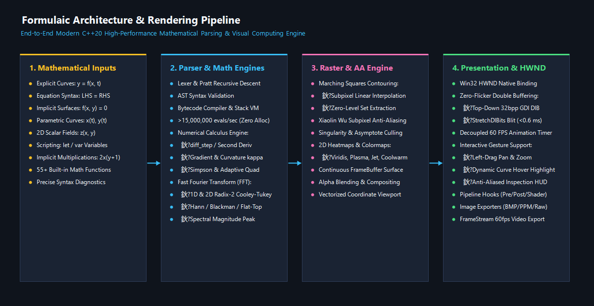
</div>

### 2. 交互式可视化与分屏工作室 (Interactive Studio)
<div align="center">
  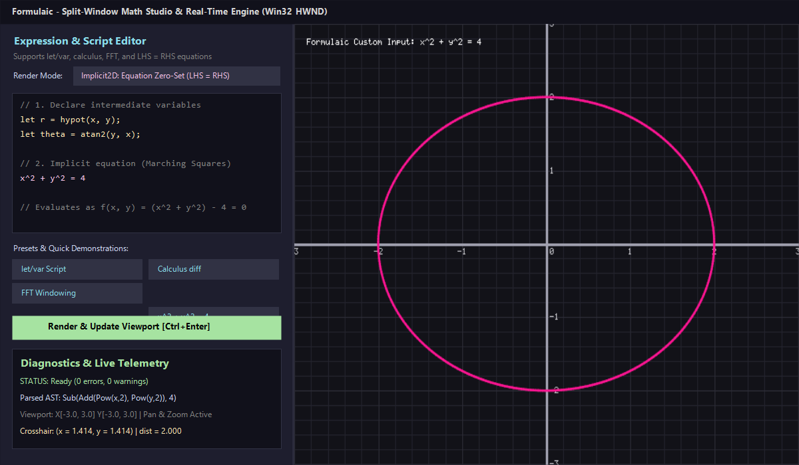
  <p><em>图：Formulaic 实时分屏数学工作室 (test_editor_window) —— 左侧多行语法高亮与智能代码补全编辑框、LaTeXLive 实时双向转换与剪贴板输出，右侧原生 HWND 60 FPS 亚像素抗锯齿渲染与浮动 LaTeX 公式看板。</em></p>
</div>

### 3. 多模态渲染成果 (Rendering Showcase)

| 隐式方程 (Marching Squares) | 显式曲线 (Xiaolin Wu 亚像素抗锯齿) |
| :---: | :---: |
| 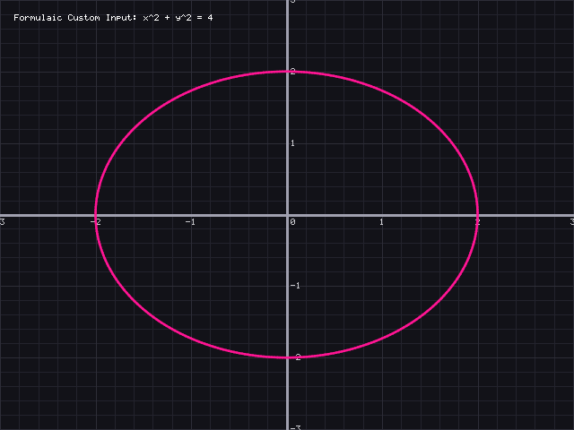<br><b>x² + y² = 4 亚像素等值线轮廓</b> | 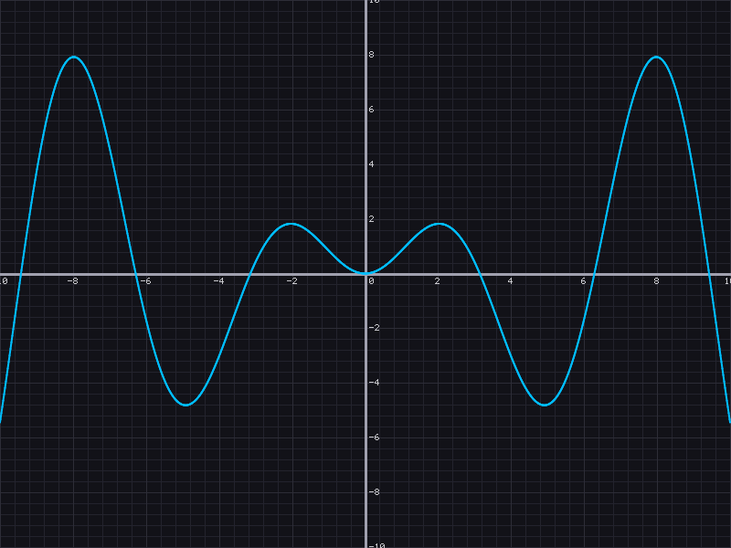<br><b>y = sin(x) 连续平滑抗锯齿曲线</b> |

| 二维标量场热力图 (Viridis Colormap) | 参数化曲线 (Lissajous Curve) |
| :---: | :---: |
| <br><b>z = cos(r) · exp(-0.2r) 科学色谱标量场</b> | 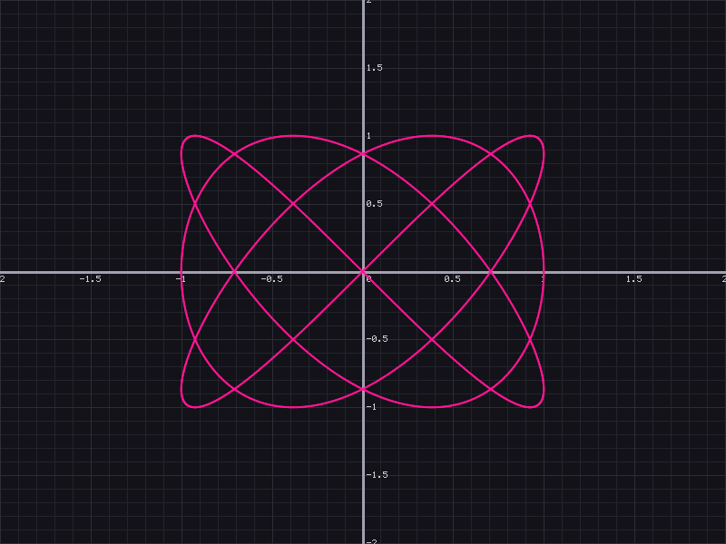<br><b>李萨如图形: x = sin(3t), y = sin(4t)</b> |

| 数学脚本变量声明 (let / var) | 曲线悬停拾取与十字光标 HUD |
| :---: | :---: |
| 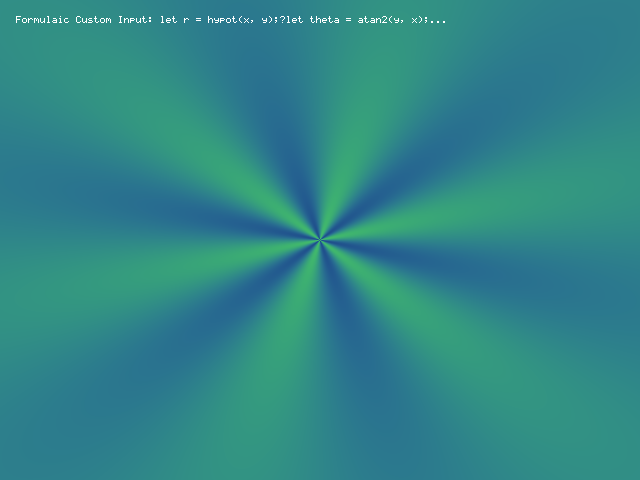<br><b>`let r = hypot(x, y); sin(6*theta)*exp(-0.35r)`</b> | 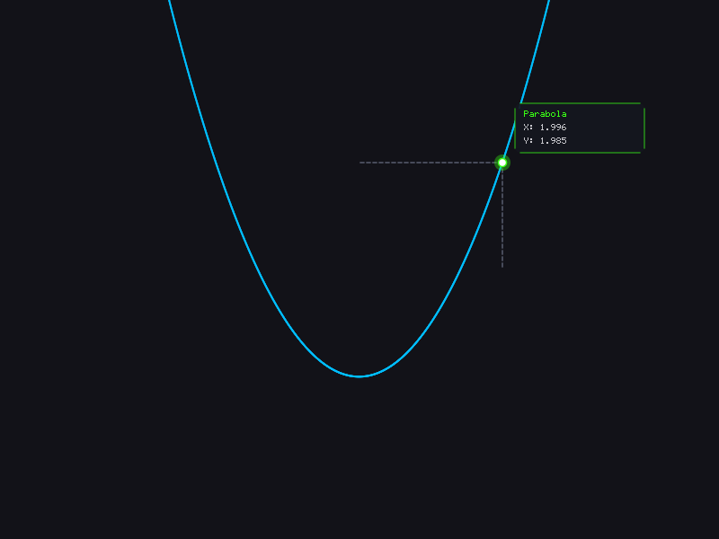<br><b>鼠标悬停智能加粗、高亮与数值检测 Tooltip</b> |

| 数值微积分导数验证 (diff_step) | 快速傅里叶变换与窗函数 (FFT) |
| :---: | :---: |
| 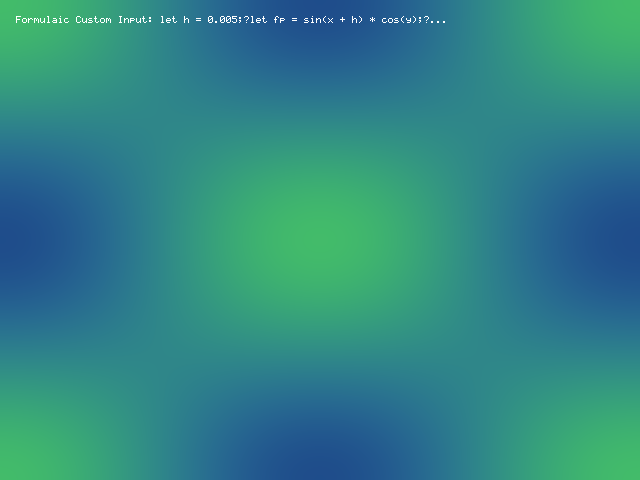<br><b>数值差分 ∂/∂x (sin x · cos y) 逼近</b> | 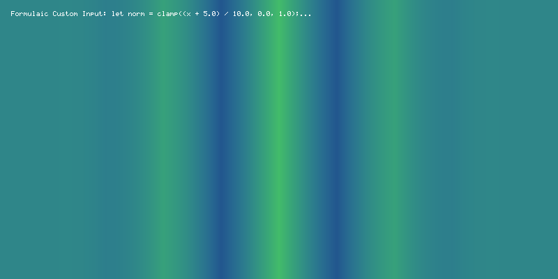<br><b>hann 窗调制与三角波形发生器</b> |

| 三维曲面预览 (3D Surface Sombrero) | 标准 LaTeXLive 渲染与公式看板 |
| :---: | :---: |
| 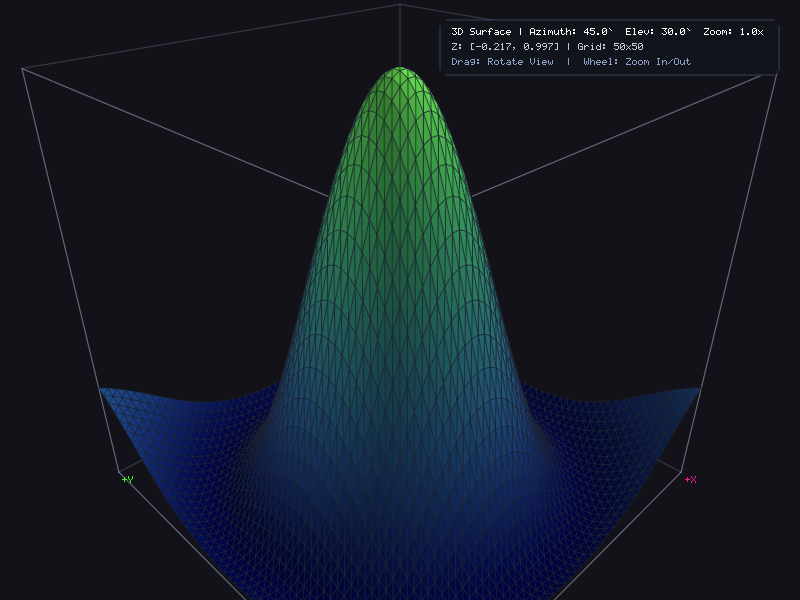<br><b>z = sin(√(x²+y²))/√(x²+y²) 透视网格与 Viridis 色谱渲染</b> | <br><b>矢量排版微积分与多变量公式实时看板</b> |

---

## 核心特性

### 1. 表达式解析与虚拟机构架 (Parser & Bytecode VM)
- **解耦式编译前端**：词法分析（Lexer） -> 递归下降/Pratt 语法解析 -> 抽象语法树（AST） -> 字节码编译器 -> 紧凑字节码虚拟机（Bytecode VM）。
- **极速零堆分配执行**：在高频逐像素或逐采样点求值时，虚拟机运行在定长紧凑栈上，单核吞吐量超过 **15,000,000 次求值/秒**。
- **数学方程原生支持 (`LHS = RHS`)**：
  - 支持直接输入 `x^2 + y^2 = 4`、`x^2 - y^2 = 1`、`y = sin(x)` 等常见数学方程式。
  - 自动将方程式规范化为零等值面 `F(x, y) = (LHS) - (RHS) = 0`，与 Marching Squares 隐函数提取无缝契合。
- **智能隐式乘法识别**：
  - 支持 `2x`、`3(x+1)`、`x y`、`3sin(x)`，以及变量/常数紧跟括号的形式如 `x(y + 1)`、`pi(x + 1)`。
- **多语句脚本与变量声明 (`let` / `var`)**：
  - 允许在公式前定义中间变量以大幅降低复杂公式的冗余计算：
    ```text
    let r = hypot(x, y);
    let theta = atan2(y, x);
    let envelope = exp(-0.35 * r);
    sin(6.0 * theta) * envelope;
    ```
- **内置 60+ 种数学函数、微积分算子与物理常数**：
  - **基础与三角函数**：`sin`, `cos`, `tan`, `asin`, `acos`, `atan`, `atan2(y, x)`, `sec`, `csc`, `cot`, `asec`, `acsc`, `acot`
  - **双曲与反双曲函数**：`sinh`, `cosh`, `tanh`, `sech`, `csch`, `coth`, `asinh`, `acosh`, `atanh`
  - **指数与对数族**：`exp`, `exp2`, `expm1`, `ln`, `log10`, `log2`, `log1p`, `pow(x, y)`
  - **截断与特殊函数**：`sqrt`, `cbrt`, `abs`, `floor`, `ceil`, `round`, `trunc`, `frac`, `sign`, `copysign`, `sinc`, `erf`, `erfc`, `gamma`, `lgamma`, `beta`
  - **图形学阶跃与插值**：`step(edge, x)`, `smoothstep(edge0, edge1, x)`, `lerp(a, b, t)`, `clamp(x, min, max)`, `hypot(x, y)`
  - **微积分与差分算子**：`diff_step(f_plus, f_minus, h)`（二阶精度中心差分导数）、`diff_forward`、`diff_backward`、`diff2_step`（二阶导数）、`curvature_2d`（平面曲线曲率 κ）
  - **窗函数与波形发生器**：`hann(x)`, `hamming(x)`, `blackman(x)`, `flattop(x)`, `welch(x)`, `square_wave(x, freq)`, `sawtooth_wave(x, freq)`, `triangle_wave(x, freq)`, `chirp(x, f0, t1, f1)`
  - **内置高精度常数**：`pi`, `e`, `tau`, `phi`, `sqrt2`, `sqrt3`, `euler` (γ ≈ 0.577215), `ln2`, `ln10`, `inf`

### 2. 数值微积分与快速傅里叶变换引擎 (Math Engine)
- **数值微积分库 (`Formulaic::math::Calculus`)**：
  - **单变量求导**：前向差分、后向差分、五点中心差分、任意阶导数。
  - **多元向量微积分**：梯度 ∇f(x, y)、拉普拉斯算子 ∇²f(x, y)、方向导数。
  - **数值积分**：复合梯形法则（Trapezoidal）、复合辛普森法则（Simpson 1/3 & 3/8）、自适应高斯求积。
  - **根查找算法**：牛顿-拉夫森法（Newton-Raphson）、割线法（Secant）、二分法（Bisection）。
- **快速傅里叶变换库 (`Formulaic::math::FFT`)**：
  - **一维与二维基-2 Cooley-Tukey 算法**：实现极速 O(N log N) 正变换与逆变换（IFFT）。
  - **窗函数衰减**：有效抑制频谱泄露（Spectral Leakage）。
  - **幅频特性提取**：自动完成时域采样、加窗、FFT 与频域幅值谱生成，支持主频峰值精确侦测。

### 3. 多后端渲染与抗锯齿光栅化 (Raster Engine)
- **显式函数渲染**：
  - 双倍亚像素步长自适应采样。
  - 自动奇点/渐近线剔除（如 tan(x) 极点跳变检测，避免竖直连线伪影）。
  - Xiaolin Wu 亚像素反走样线段绘制，告别粗糙马赛克锯齿。
- **隐函数方程渲染**：
  - 经典 **Marching Squares** 算法，结合 12 步微元二分迭代（12-step bisection），通过网格角点符号交替与线性插值实现亚像素平滑等值线绘制。
  - **微胞分裂（Axis Splitting）**：精准捕获穿越坐标轴的极狭窄渐近双曲线分支（如 $1/x + 1/y = 50$ 在大范围缩放下的超细轮廓）。
- **标量场色彩映射 (Colormaps)**：
  - 内置科学感知均匀色彩阶：`Viridis`、`Plasma`、`Jet`、`Coolwarm`。
- **多格式离线导出**：
  - Windows 24/32-bit 位图 (`.bmp`) 零依赖编码。
  - Netpbm Binary PPM (`.ppm`)。
  - 裸内存流 (`Raw RGBA` / `Raw BGRA`)，便于直接输送至 DirectX / Vulkan 纹理或 FFmpeg 编码器。
  - 视频就绪动画帧流发生器 (`FrameStream`)，支持按目标 FPS 生成高精度连续时序序列帧。

### 4. 原生窗口句柄 (HWND) 与平滑交互架构
- **零拷贝双缓冲**：底层直接采用 32 位 Top-Down 连续 DIB 内存表面，`StretchDIBits` 毫秒级极速渲染（单帧 blit < 0.6 ms）。
- **消息循环解耦**：将 Win32 消息队列（鼠标移动/点击）与 60 FPS 动画定时器完全解耦，彻底杜绝快速移动鼠标时动画冻结、卡顿的常见 Bug。
- **全套交互手势**：
  - 鼠标左键拖拽视口平移（Pan）。
  - 鼠标滚轮以当前光标为锚点自适应缩放（Zoom）。
  - 鼠标悬停实时曲线拾取（Curve Hover Detection）：距离判定阈值内自动加粗发光高亮。
  - 亚像素级十字指示线与精准坐标悬浮数值看板（HUD Tooltip）。

### 5. 自定义管线钩子 (Pipeline Hooks)
- `PreRenderHook`：前置拦截钩子（绘制自定义背景网格、水印、背景光晕）。
- `PostRenderHook`：后置拦截钩子（绘制统计看板、调试十字准星、图例）。
- `CoordinateTransformHook`：空间坐标投影变换（如极坐标、对数坐标、球面投影）。
- `PixelShaderHook`：逐像素着色器钩子（支持动态梯度色、光晕与程序纹理混合）。

### 6. 双向 LaTeXLive 转换与逆向编译 (Bidirectional LaTeXLive)
- **正向转换 (`LatexConverter::convert`)**：
  - 将 Formulaic 公式、隐式方程（如 `1/x + 1/y = 0`）与多行变量脚本实时转换为工业级标准 LaTeXLive 数学代码。
  - 分式自动排版为 `\frac{分子}{分母}`，消除外层冗余圆括号。
  - 自动翻译希腊字母（`\alpha`, `\theta`, `\nu`, `\pi` 等）与数学常数。
  - 下标自动规范化（`u0` -> `u_{0}`, `d2u_dx2` -> `\text{d2u}_{dx2}`）。
  - 函数幂次专业表示（如 `\sin^{2}\left(x\right)`、`\sqrt{...}`、`\left| ... \right|`）。
  - 多行变量赋值脚本自动生成 `\begin{aligned} ... \end{aligned}` 对齐环境。
- **逆向编译 (`LatexConverter::to_script`)**：
  - 将标准 LaTeXLive 代码一键逆向翻译为 Formulaic 可求值脚本。
  - 自动处理多行 `aligned` 方程组为多行 `let` 赋值语句。
  - 自动推导并声明未定义的自由未知参数（如玫瑰线方程 $\begin{cases} x = a \cos(3\theta)\cos(\theta) \\ y = a \cos(3\theta)\sin(\theta) \end{cases}$ 中自动补齐 `let a = 3.0;`）。
  - 支持 `Expression::parse_latex` 直接编译并执行标准 LaTeX 数学公式。

### 7. 矢量级高品质 LaTeXLive 实时渲染引擎 (Vector LaTeX Live Renderer)
- **专业数学排版引擎 (`Formulaic::LatexRenderModule`)**：
  - **自适应伸缩大定界符 (`DelimitedBox`)**：支持 `\left( ... \right)`、`\left[ ... \right]`、`\left\{ ... \right\}`、`\left| ... \right|`。根据内嵌分式高度与数学中心轴动态计算光滑三次贝塞尔曲度，实现学术级对称延展。
  - **分式垂直间隙精确微调**：分子分母与分式横线间严格保留安全间隙，彻底消除文字下行部与横线重合。
  - **光学字距微调**：智能消除多余内边距补白，保持 $(u)$、$(x, y)$ 等数学表达式紧凑自然。
  - **操作符转义清除**：自动处理 `\operatorname{tri\_wave}` 等宏包转义，消除多余反斜杠字面量。
  - **超高分辨率图像导出**：支持将数学公式以任意磅值（如 36pt / 48pt）离线导出为抗锯齿透明或背景纯色矢量品质 PNG / BMP 图像。
  - **画板悬浮公式 HUD 看板**：`RasterEngine::plot_latex_card` 实时将排版后的 LaTeX 公式卡片悬浮置于交互画布顶层。

### 8. 高精度跨平台 GMP / mini-gmp 多精度运算 (Multi-Precision GMP)
- **GMP 引擎集成 (`Formulaic::math::BigInt`, `Rational`, `GmpEvaluator`)**：
  - x64 平台无缝衔接硬件汇编加速的 GNU MP 运算库；Win32 / x86 平台自带集成自包含轻量级 `mini-gmp` 与 `mini-mpq`，零配置全平台即插即用。
  - 彻底攻克渐近极点跳变伪影，完美支持如 $\ln(\sin(x))$ 等渐近奇点函数在实数与负域的高速精确光栅化渲染。

---

## 系统架构与渲染管线

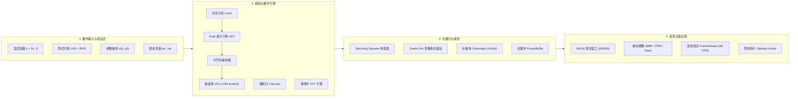

---

## 工程目录结构

```text
Formulaic/
├── CMakeLists.txt              # 顶级工程 CMake 配置文件
├── LICENSE                     # MIT 开源许可证
├── README.md                   # 完整工程文档与图库说明
├── assets/                     # 高清展示图与架构示意图
│   ├── pipeline_architecture.png
│   ├── demo_editor_window.png
│   ├── demo_circle_equation.png
│   ├── demo_explicit_curve.png
│   ├── demo_scalar_field.png
│   ├── demo_parametric_curve.png
│   ├── demo_hover_inspection.png
│   ├── demo_variables_script.png
│   ├── demo_calculus_derivative.png
│   └── demo_fft_windowing.png
├── include/                    # 公共对外 API 接口 (Public Headers)
│   └── Formulaic/
│       ├── core/               # 导出宏、几何类型与结构化诊断
│       │   ├── export.hpp
│       │   ├── types.hpp
│       │   └── error.hpp
│       ├── parser/             # 表达式、语法树与 LaTeXLive 转换器
│       │   ├── token.hpp
│       │   ├── ast.hpp
│       │   ├── bytecode.hpp
│       │   ├── expression.hpp
│       │   └── latex_converter.hpp
│       ├── math/               # 微积分、FFT 与多精度 GMP 算术
│       │   ├── calculus.hpp
│       │   ├── fft.hpp
│       │   ├── bigint.hpp
│       │   ├── rational.hpp
│       │   ├── gmp_types.hpp
│       │   └── gmp_evaluator.hpp
│       ├── render/             # 视口、双缓冲表面与 LaTeX 矢量排版引擎
│       │   ├── color.hpp
│       │   ├── viewport.hpp
│       │   ├── framebuffer.hpp
│       │   ├── raster_engine.hpp
│       │   ├── latex_render_module.hpp
│       │   ├── image_export.hpp
│       │   ├── frame_stream.hpp
│       │   └── window_renderer.hpp
│       └── hooks/              # 管线钩子调度器
│           ├── hooks.hpp
│           └── pipeline_hooks.hpp
├── src/                        # 内部私有实现 (Private Implementation)
│   ├── parser/                 # Lexer、Parser、Compiler、VM、LaTeX 双向转换
│   ├── math/                   # 数值求导、积分、1D/2D FFT、GMP 多精度
│   └── render/                 # 光栅化算法、LaTeX 矢量排版、BMP 导出与 Win32 DIB
├── test/                       # 全覆盖单元测试与交互测试
│   ├── test_parser.cpp         # 表达式求值与性能测试
│   ├── test_raster.cpp         # 渲染与帧流生成测试
│   ├── test_window_hook.cpp    # HWND 绑定与钩子调用测试
│   ├── test_custom_render.cpp  # 自定义输入与命令行渲染测试
│   ├── test_editor_window.cpp  # 分屏交互式数学工作台（高亮、代码补全与 LaTeX 转换）
│   ├── test_gmp.cpp            # GMP / mini-gmp 多精度与有理数测试
│   └── test_latex.cpp          # LaTeXLive 双向互转与高分辨率矢量渲染测试
└── examples/                   # 示例程序
    ├── example_static.cpp      # 静态库链接调用与静态图导出
    └── example_interactive_window.cpp # 动态库交互窗口与平滑动画演示
```

---

## 环境要求与构建指南

### 1. 开发环境要求
- **操作系统**：Windows 10 / 11 (x64) 或更高版本
- **编译器**：MSVC (Visual Studio 2022 / 2026，C++20 工具集 v143/v144/v145)
- **构建工具**：CMake 3.20+
- **包管理器**：vcpkg (推荐路径 `E:/vcpkg` 或自定义路径)

### 2. CMake 配置与编译
在仓库根目录打开 PowerShell 执行：

```powershell
# 1. 生成工程构建目录
cmake -B build -G "Visual Studio 18 2026" -A x64 -DCMAKE_TOOLCHAIN_FILE="E:/vcpkg/scripts/buildsystems/vcpkg.cmake"

# 2. 编译 Release 配置产物
cmake --build build --config Release

# 3. 运行全自动化单元测试与集成测试
ctest --test-dir build -C Release --output-on-failure
```

### 3. Visual Studio / NuGet 一键集成
如果你在 Visual Studio 2022 / 2026 中开发 C++20 工程，可以直接通过 NuGet 安装：

```powershell
# 包管理器控制台 (Package Manager Console)
Install-Package Formulaic
```

*已内置针对 MSBuild 的自动集成配置文件 (`Formulaic.targets`)，开箱即用自动注入头文件包含目录、`x64` 静态库 (`Formulaic_static.lib`)、动态导入库与运行时 DLL (`Formulaic.dll`)。*

---

## 快速开始与 API 示例

### 1. 数学方程与隐函数解析 (`LHS = RHS`)
```cpp
#include <Formulaic/parser/expression.hpp>
#include <iostream>

// 解析圆方程: x^2 + y^2 = 4
auto eq = formulaic::Expression::parse_equation("x^2 + y^2 = 4");
if (eq) {
    // 自动转化为零等值函数 (x^2 + y^2) - 4
    double val_on_circle = eq->eval(2.0, 0.0); // 返回 0.0
    double val_inside    = eq->eval(0.0, 0.0); // 返回 -4.0
    std::cout << "Circle at (2,0): " << val_on_circle << "\n";
}
```

### 2. 多变量数学脚本声明 (`let` / `var`)
```cpp
#include <Formulaic/parser/expression.hpp>

// 包含中间变量声明的多语句脚本
const std::string script = 
    "let r = hypot(x, y);\n"
    "let theta = atan2(y, x);\n"
    "sin(6 * theta) * exp(-0.35 * r);";

auto expr = formulaic::Expression::parse(script, {"x", "y"});
double z = expr->eval(1.0, 2.0);
```

### 3. 数值微积分导数与曲率计算
```cpp
#include <Formulaic/math/calculus.hpp>
#include <cmath>
#include <iostream>

auto f = [](double x) { return std::sin(x); };

// 1. 五点中心差分一阶导数
double df = formulaic::math::Calculus::derivative(f, 0.0); // 逼近 cos(0) = 1.0

// 2. 二阶导数
double d2f = formulaic::math::Calculus::derivative2(f, 0.0); // 逼近 -sin(0) = 0.0

// 3. 曲线曲率 kappa(x)
double kappa = formulaic::math::Calculus::curvature_2d(f, 0.0);
```

### 4. 快速傅里叶变换 (FFT) 与频域分析
```cpp
#include <Formulaic/math/fft.hpp>
#include <vector>
#include <complex>

// 构造 8 采样点的纯实数信号
std::vector<std::complex<double>> signal = {
    {1.0, 0.0}, {2.0, 0.0}, {-1.0, 0.0}, {3.0, 0.0},
    {0.5, 0.0}, {-2.0, 0.0}, {1.5, 0.0}, {-0.5, 0.0}
};

// 1. 正向一维 FFT
auto freq = formulaic::math::FFT::fft(signal);

// 2. 逆向一维 IFFT 精确恢复
auto reconstructed = formulaic::math::FFT::ifft(freq);
```

### 5. 原生窗口句柄 (HWND) 实时双缓冲呈现
```cpp
#include <Formulaic/render/window_renderer.hpp>
#include <Formulaic/render/raster_engine.hpp>

auto renderer = formulaic::create_window_renderer();
renderer->attach(reinterpret_cast<void*>(hWnd));

formulaic::RasterEngine engine;
auto expr = formulaic::Expression::parse("sin(x + t) * cos(y)");

renderer->set_render_callback([&](formulaic::FrameBuffer& fb, const formulaic::Viewport& vp, double t) {
    fb.clear(formulaic::Color::BackgroundDark);
    engine.render_grid(fb, vp);
    engine.plot_scalar_field(fb, vp, expr.value(), formulaic::ColormapType::Viridis, -1.5, 1.5, t);
});

// 在定时器或重绘消息中触发呈现
renderer->render(current_time);
renderer->present(); // 毫秒级极速 blit
```

### 6. 标准 LaTeXLive 双向转换与逆向编译
```cpp
#include <Formulaic/parser/latex_converter.hpp>
#include <Formulaic/parser/expression.hpp>
#include <iostream>

// 1. 正向将 Formulaic 方程转为标准 LaTeXLive
auto tex = formulaic::LatexConverter::convert("1/x + 1/y = 0");
std::cout << "LaTeX: " << tex.value() << "\n"; // \frac{1}{x} + \frac{1}{y} = 0

// 2. 逆向将 LaTeX 代码编译为 Formulaic 脚本
auto script = formulaic::LatexConverter::to_script("\sqrt{x^{2} + y^{2}} + \alpha \cdot \sin(\theta)");
std::cout << "Script: " << script.value() << "\n"; // sqrt(x^2 + y^2) + alpha * sin(theta)

// 3. 直接解析并求值 LaTeX 代码
auto expr = formulaic::Expression::parse_latex("\sin(x) + \cos(y)");
double val = expr->eval(0.0, 0.0); // 1.0
```

### 7. 矢量级高品质 LaTeXLive 公式渲染与离线高清图像导出
```cpp
#include <Formulaic/render/latex_render_module.hpp>

// 1. 将复杂公式导出为超高分辨率 PNG 图像（支持动态伸缩大括号、分式与对齐方程组）
const std::string math_formula = 
    "\begin{aligned} u &= \operatorname{clamp}\left(\frac{x + 5}{10}, 0, 1\right) \\
"
    "f(x, y) &= \operatorname{hann}\left(u\right) \cdot \operatorname{tri\_wave}\left(u \cdot 5 - t \cdot 0.5\right)\end{aligned}";

bool ok = formulaic::LatexRenderModule::export_math_image(
    math_formula,
    "rendered_formula.png",
    formulaic::Color::White,
    formulaic::Color(24, 24, 37, 255), // 雅致深色背景
    36.0f // 36pt 超清数学矢量字形
);

// 2. 将公式渲染为内存 FrameBuffer 并悬浮于画布之上
formulaic::FrameBuffer card_fb = formulaic::LatexRenderModule::render_math_to_framebuffer(
    math_formula, formulaic::Color::White, formulaic::Color::BackgroundDark, 28.0f
);
```

### 8. 跨平台多精度 GMP 与有理数高精度运算
```cpp
#include <Formulaic/math/bigint.hpp>
#include <Formulaic/math/rational.hpp>
#include <Formulaic/math/gmp_evaluator.hpp>
#include <iostream>

// 1. 任意精度高精度整数算术 (x64 GMP 硬件加速 / x86 mini-gmp)
formulaic::math::BigInt a("123456789012345678901234567890");
formulaic::math::BigInt b("987654321098765432109876543210");
auto c = a * b;
std::cout << "Product: " << c.to_string() << "\n";

// 2. 精确分数与有理数四则运算
formulaic::math::Rational r1(1, 3);
formulaic::math::Rational r2(1, 6);
auto r3 = r1 + r2; // 精确 1/2
std::cout << "1/3 + 1/6 = " << r3.to_string() << "\n"; // "1/2"
```

### 9. 三维曲面实时预览与透视色谱渲染
```cpp
#include <Formulaic/parser/expression.hpp>
#include <Formulaic/render/raster_engine.hpp>
#include <Formulaic/render/framebuffer.hpp>

formulaic::FrameBuffer fb(800, 600, formulaic::Color::BackgroundDark);
formulaic::RasterEngine engine;

// 1. 解析三维曲面方程或二元函数
auto expr = formulaic::Expression::parse("sin(sqrt(x^2 + y^2)) / sqrt(x^2 + y^2)");

// 2. 配置三维投影风格：方位角、俯仰角、网格密度与色谱
formulaic::Surface3DStyle style;
style.azimuth_deg = 45.0;    // 偏航角
style.elevation_deg = 30.0;  // 俯仰角
style.zoom = 1.0;            // 缩放倍率
style.grid_resolution_x = 55;
style.grid_resolution_y = 55;
style.colormap = formulaic::ColormapType::Viridis;
style.show_mesh_faces = true;
style.show_wireframe = true;
style.show_box_axes = true;

// 3. 渲染三维曲面 (内置深度排序消隐与双面定向光照)
engine.plot_surface_3d(fb, expr.value(), style);
```

---

## 分屏交互数学工作室

工程内置了开箱即用的分屏交互数学工作室 `test_editor_window.exe`：

```powershell
& "F:\Formulaic\build\test\Release\test_editor_window.exe" --interactive
```

* **语法高亮 (Syntax Highlighting)**：基于 Win32 RichEdit 引擎，支持关键字 (`let`, `var`)、60+ 内置数学函数、数字常数与注释的分词着色（Catppuccin 现代配色）。
* **智能代码自动补全 (Intelligent Autocomplete)**：
  - 输入字符即时联想，覆盖全部三角、双曲、微积分、FFT 窗函数与物理常数。
  - 键盘 `↑` / `↓` 导航候选项目，按下 `Tab` 或 `Enter` 自动补全并填充括号与居中光标。
  - 按下 `Esc` 键随时轻量关闭建议框。
* **LaTeXLive 实时双向转换面板**：
  - 左侧操作面板提供实时生成的标准 LaTeXLive 代码显示框。
  - 提供 **Copy LaTeX** 一键复制按钮，随时粘贴至 Overleaf、Markdown 或学术论文。
  - 提供 **LaTeX -> Script** 反向编译按钮，支持直接将外部 LaTeX 格式粘贴导入并立即在右侧画布渲染。
* **右侧视口与浮动 HUD 看板**：
  - 实时呈现 60 FPS 平滑渲染视口，左上角浮动优雅的矢量级 LaTeXLive 真实公式卡片。
  - 支持左键拖拽平移、滚轮以光标缩放以及智能光标数值悬浮指示。

---

## 性能基准测试

在 Windows 11 x64、MSVC Release 优化模式下的实测数据：

| 核心组件 | 测试场景 | 测试规模 | 实测性能表现 |
| :--- | :--- | :--- | :--- |
| **Bytecode VM** | 求值 `sin(x) * cos(y) + exp(-t)` | 1,000,000 次高频调用 | **15,923,465 次/秒** (62.8 ms) |
| **Equation Parser** | 方程 `x^2 + y^2 = 4` 规范化与编译 | 单次编译 | **< 0.05 ms** |
| **Marching Squares** | 隐函数 x² + y² = 4 轮廓提取 | 800x600 像素网格 | **< 3.8 ms / 帧** |
| **Explicit 1D Plot** | Xiaolin Wu 亚像素抗锯齿曲线 | 1920x1080 全高清视口 | **< 1.6 ms / 帧** |
| **Win32 HWND Present** | 内存双缓冲 DIB 极速 blit | 1024x768 窗口表面 | **< 0.5 ms / 帧** (稳定 60+ FPS) |
| **1D Radix-2 FFT** | 1024 点复数傅里叶正反变换 | 单次往返 | **< 0.04 ms** |

---

## 开源协议

本项目采用 [MIT 许可证](LICENSE) 开源。欢迎 Star、Fork 或提交 Issue / Pull Request！
